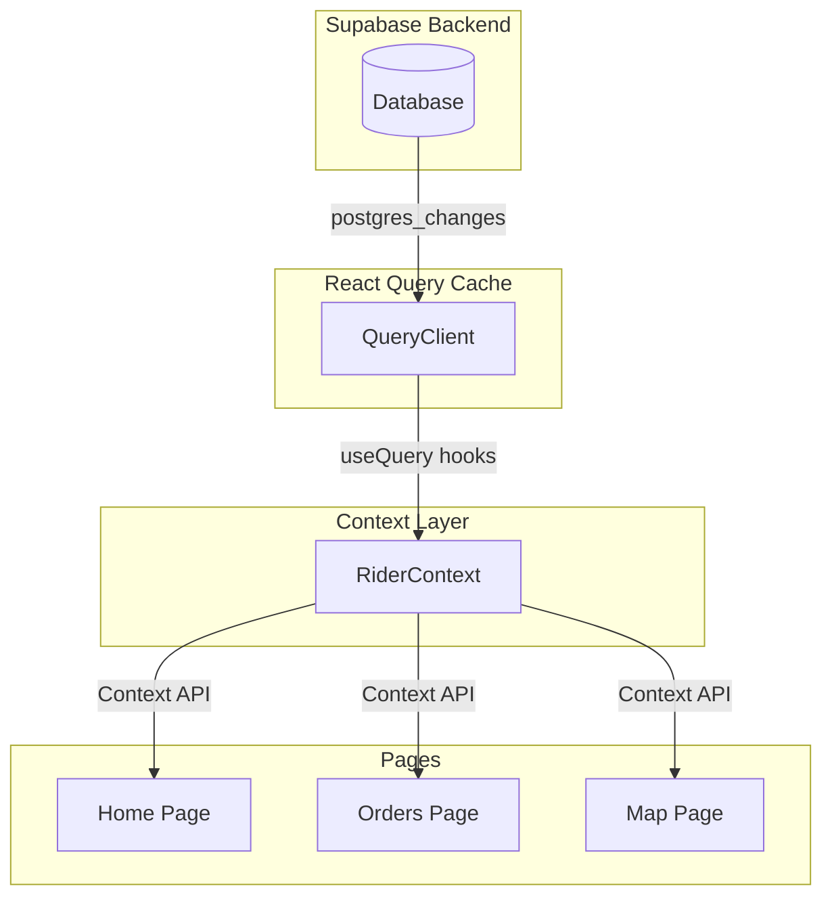

# Rider Multi-Page Dashboard Architecture

## Executive Summary

This document defines the architectural redesign for separating the current unified rider dashboard into distinct, dedicated pages. The current implementation mixes Orders, Map, and Dashboard views within a single component using tab-based state management. This architecture separates these concerns into clean, focused pages with proper routing, shared state management, and clear component hierarchies.

---

## 1. Current Architecture Analysis

### 1.1 Existing File Structure

```
frontend/src/
├── pages/
│   └── RiderDashboard.tsx              # 576 lines - Unified dashboard
├── components/rider/
│   ├── SpeedMeter.tsx                  # 393 lines - GPS speedometer
│   ├── RiderStatusHeader.tsx           # 119 lines - Status with toggle
│   ├── RiderBottomNav.tsx              # 105 lines - Bottom navigation
│   ├── RiderDashboardMap.tsx           # 246 lines - Google Maps integration
│   ├── IncomingOrderSheet.tsx          # 134 lines - Order acceptance modal
│   ├── RiderOrderRequestCard.tsx       # Order card component
│   ├── RiderProfilePanel.tsx           # Profile slide-up panel
│   ├── RiderHeatmap.tsx               # Heatmap visualization
│   └── NavigationTopCard.tsx          # Navigation info overlay
└── hooks/
    └── useRiderDashboard.tsx           # 889 lines - All data fetching logic
```

### 1.2 Current Implementation Issues

| Issue | Impact | Location |
|-------|--------|----------|
| Single component with conditional rendering | Difficult to maintain, poor performance | [`RiderDashboard.tsx:248-527`](frontend/src/pages/RiderDashboard.tsx) |
| Mixed concerns in one file | Orders, Map, Earnings, Profile all in switch statement | [`RiderDashboard.tsx`](frontend/src/pages/RiderDashboard.tsx) |
| Tab state managed in parent | Re-renders entire tree on tab change | [`RiderDashboard.tsx:62`](frontend/src/pages/RiderDashboard.tsx) |
| Inline styles and complex conditionals | Code smell, hard to follow logic | Multiple locations |
| Map loaded even when not visible | Performance overhead | [`RiderDashboard.tsx:254-262`](frontend/src/pages/RiderDashboard.tsx) |

### 1.3 Current Navigation Structure

The current [`RiderBottomNav.tsx`](frontend/src/components/rider/RiderBottomNav.tsx) defines tabs:

```typescript
// Current implementation - lines 21-27
const tabs = [
  { id: 'home', label: 'Home', icon: Home },
  { id: 'orders', label: 'Orders', icon: Package, badge: pendingCount + activeCount },
  { id: 'map', label: 'Map', icon: MapIcon },
  { id: 'earnings', label: 'Earnings', icon: Wallet },
  { id: 'profile', label: 'Profile', icon: User },
];
```

Current routing in [`App.tsx`](frontend/src/App.tsx:170-186):

```typescript
// Both routes point to same component - anti-pattern
<Route path="/rider" element={<RiderDashboard />} />
<Route path="/rider-dashboard" element={<RiderDashboard />} />
```

---

## 2. Proposed Multi-Page Architecture

### 2.1 New Page Structure

```
frontend/src/
├── pages/rider/
│   ├── RiderHomePage.tsx              # Home/Dashboard - Speedometer, quick stats
│   ├── RiderOrdersPage.tsx            # Orders list - Pending, Active, Completed
│   ├── RiderMapPage.tsx               # Full-screen map - Navigation, tracking
│   ├── RiderEarningsPage.tsx          # Earnings history (existing)
│   ├── RiderProfilePage.tsx           # Profile settings (new dedicated page)
│   └── RiderDashboardLayout.tsx       # Layout wrapper with navigation
├── components/rider/
│   ├── SpeedMeter.tsx                 # [Unchanged]
│   ├── RiderStatusHeader.tsx          # [Unchanged]
│   ├── RiderBottomNav.tsx             # [Refactored - routing links]
│   ├── RiderDashboardMap.tsx          # [Enhanced for full-screen]
│   ├── RiderOrderCard.tsx             # Reusable order card
│   ├── IncomingOrderSheet.tsx         # [Unchanged]
│   └── (shared components...)
└── hooks/
    └── useRiderDashboard.tsx         # [Unchanged - shared hooks]
```

### 2.2 New Routing Structure

```typescript
// New App.tsx routing
<Route path="/rider" element={<RiderDashboardLayout />}>
  <Route index element={<RiderHomePage />} />
  <Route path="orders" element={<RiderOrdersPage />} />
  <Route path="map" element={<RiderMapPage />} />
  <Route path="earnings" element={<RiderEarningsPage />} />
  <Route path="profile" element={<RiderProfilePage />} />
</Route>
```

---

## 3. Page Specifications

### 3.1 Home/Dashboard Page (`RiderHomePage.tsx`)

**Purpose**: Overview with speedometer, quick stats, active delivery status

**Route**: `/rider` (index)

**Component Hierarchy**:

```
RiderHomePage
├── RiderStatusHeader              # Online toggle, rider name
├── SpeedMeter                     # Central focal point - GPS speed
├── QuickStatsRow                  # Today's earnings, deliveries count
├── ActiveDeliveryCard             # (Conditional - only when has active delivery)
│   ├── DestinationInfo
│   ├── NavigationStats (ETA, distance)
│   └── ActionButtons (Navigate, Complete)
├── PendingOrdersPreview           # (Conditional - when idle and has pending)
│   └── RiderOrderCard (compact)
└── IncomingOrderSheet             # Global overlay
```

**UI Specifications**:

| Element | Specification |
|---------|---------------|
| Speedometer | 320x320px, centered, animated gauge |
| Status Header | Minimal - 56px height, online indicator |
| Quick Stats | Horizontal bar below speedometer, 2 columns |
| Active Delivery | Full-width card at bottom when has delivery |
| Pending Preview | Show max 2 pending orders when idle |

**Data Requirements**:

```typescript
// useRiderHomePage hook composes data from:
const { data: riderProfile } = useRiderProfile();
const { data: activeDeliveries } = useMyActiveDeliveries();
const { data: pendingRequests } = usePendingRequests();
const { data: earningsSummary } = useRiderEarningsSummary(riderProfile?.id);
const { currentSpeed } = useRiderLocation(riderProfile?.id, riderProfile?.is_online);
```

### 3.2 Orders Page (`RiderOrdersPage.tsx`)

**Purpose**: Dedicated orders list with pending, active, and completed orders

**Route**: `/rider/orders`

**Component Hierarchy**:

```
RiderOrdersPage
├── OrdersPageHeader               # Title, filter tabs
├── OrdersTabsContainer
│   ├── PendingOrdersTab
│   │   └── RiderOrderCard[]      # Pending requests
│   ├── ActiveOrdersTab
│   │   └── RiderOrderCard[]     # Active deliveries
│   └── CompletedOrdersTab
│       └── RiderOrderCard[]     # Completed deliveries
└── OrdersListContainer           # Scrollable list wrapper
```

**UI Specifications**:

| Element | Specification |
|---------|---------------|
| Tab Bar | 3 tabs: Pending, Active, Completed |
| Tab Badges | Count badges on each tab |
| Order Cards | Full-width, show all relevant details |
| Pull-to-refresh | Enabled on mobile |
| Empty State | Illustrated empty state per tab |

**Data Requirements**:

```typescript
// useRiderOrdersPage hook composes:
const { data: pendingRequests } = usePendingRequests();
const { data: activeDeliveries } = useMyActiveDeliveries();
const { data: completedDeliveries } = useMyCompletedDeliveries();
const acceptRequest = useAcceptRequest();
const updateStatus = useUpdateDeliveryStatus();
```

**Tab Specifications**:

| Tab | Source | Empty Message |
|-----|--------|--------------|
| Pending | `usePendingRequests()` | "No pending orders nearby" |
| Active | `useMyActiveDeliveries()` | "No active deliveries" |
| Completed | `useMyCompletedDeliveries()` | "No completed deliveries yet" |

### 3.3 Map Page (`RiderMapPage.tsx`)

**Purpose**: Full-screen map view for navigation and location tracking

**Route**: `/rider/map`

**Component Hierarchy**:

```
RiderMapPage
├── RiderDashboardMap             # Full-screen map
│   ├── GoogleMap                 # Base map
│   ├── RiderMarker               # Current position
│   ├── DestinationMarker         # Pickup/Dropoff
│   ├── RoutePolyline             # Navigation route
│   └── NearbyRidersMarker[]      # (When idle)
├── MapHUDOverlay                 # Minimal info overlay
│   ├── NavigationInfo            # ETA, distance
│   ├── CurrentSpeed              # Speed display
│   └── ActiveDeliveryStatus      # Pickup vs Dropoff
└── MapControls                   # Zoom, center on rider
```

**UI Specifications**:

| Element | Specification |
|---------|---------------|
| Map Container | Full viewport (100vw x 100dvh - nav height) |
| HUD Overlay | Top-left, semi-transparent background |
| Navigation Info | Shows when active delivery exists |
| Zoom Controls | Bottom-right, floating action buttons |
| Center Button | Returns view to rider position |

**Data Requirements**:

```typescript
const { riderProfile } = useRiderLocation(riderProfile?.id, riderProfile?.is_online);
const { data: activeDeliveries } = useMyActiveDeliveries();
const { data: nearbyRiders } = useQuery({ queryKey: ['nearby-riders'] });
```

**Map Behaviors**:

| State | Map Behavior |
|-------|--------------|
| Idle (no delivery) | Show rider + nearby riders, fit bounds to area |
| Active - To Pickup | Show route to pickup location |
| Active - To Dropoff | Show route to dropoff location |
| GPS Signal Lost | Show last known position with indicator |

### 3.4 Earnings Page (`RiderEarningsPage.tsx`)

**Purpose**: Earnings history and wallet management (already exists)

**Route**: `/rider/earnings`

**Note**: This page already exists as [`RiderWallet.tsx`](frontend/src/pages/RiderWallet.tsx). It will be integrated into the new layout structure.

### 3.5 Profile Page (`RiderProfilePage.tsx`)

**Purpose**: Rider profile, settings, vehicle info, logout

**Route**: `/rider/profile`

**Component Hierarchy**:

```
RiderProfilePage
├── ProfileHeader
│   ├── Avatar
│   ├── RiderName
│   └── Rating
├── StatsGrid
│   ├── Total Trips
│   ├── Rating
│   └── Vehicle Type
├── SettingsList
│   ├── Vehicle Information
│   ├── Payment Methods
│   ├── Notifications Settings
│   └── App Settings
├── SupportLink
└── LogoutButton
```

---

## 4. Navigation Architecture

### 4.1 Bottom Navigation Design

The [`RiderBottomNav.tsx`](frontend/src/components/rider/RiderBottomNav.tsx) will be refactored to use React Router links instead of callback state.

**Current Implementation** (line 14-18):

```typescript
interface RiderBottomNavProps {
  activeTab: RiderTab;
  onTabChange: (tab: RiderTab) => void;
  pendingCount: number;
  activeCount: number;
}
```

**Proposed Implementation**:

```typescript
interface RiderBottomNavProps {
  pendingCount: number;
  activeCount: number;
}

// Uses NavLink from react-router-dom internally
// Active state determined by current route
```

### 4.2 Navigation Mapping

| Route | Nav Tab | Icon | Badge |
|-------|---------|------|-------|
| `/rider` | Home | Home | - |
| `/rider/orders` | Orders | Package | pendingCount + activeCount |
| `/rider/map` | Map | MapIcon | - |
| `/rider/earnings` | Earnings | Wallet | - |
| `/rider/profile` | Profile | User | - |

### 4.3 Page Transition Specification

| Transition | Animation |
|------------|-----------|
| Tab to Tab | Fade (150ms ease-out) |
| Home to Orders | Slide Left (200ms ease-in-out) |
| Orders to Home | Slide Right (200ms ease-in-out) |
| Any to Map | Fade + Scale (250ms) |

---

## 5. Shared State Management

### 5.1 Data Layer (Unchanged)

The existing hooks in [`useRiderDashboard.tsx`](frontend/src/hooks/useRiderDashboard.tsx) continue to serve all pages. No changes to the data layer are required.

```typescript
// All pages import from shared hooks
import {
  useRiderProfile,
  usePendingRequests,
  useMyActiveDeliveries,
  useMyCompletedDeliveries,
  useAcceptRequest,
  useUpdateDeliveryStatus,
  useToggleOnlineStatus,
} from '@/hooks/useRiderDashboard';
```

### 5.2 Layout State

A new context will manage layout-level state that persists across pages:

```typescript
// RiderDashboardContext.tsx
interface RiderDashboardContextValue {
  // Rider profile (reused across pages)
  riderProfile: RiderProfile | null;
  isOnline: boolean;
  
  // Order counts (for badges)
  pendingCount: number;
  activeCount: number;
  
  // Global actions
  toggleOnline: (online: boolean) => void;
}
```

### 5.3 Incoming Order Handling

The [`IncomingOrderSheet.tsx`](frontend/src/components/rider/IncomingOrderSheet.tsx) is a global overlay that should appear regardless of which page the rider is viewing.

**Implementation**: Place in the layout component, outside of `<Outlet />`:

```typescript
// RiderDashboardLayout.tsx
const RiderDashboardLayout = () => {
  const { pendingRequests } = usePendingRequests();
  const [alertRequest, setAlertRequest] = useState<RiderRequest | null>(null);
  
  // Detect new pending orders
  useEffect(() => {
    if (pendingRequests.length > 0) {
      setAlertRequest(pendingRequests[0]);
    }
  }, [pendingRequests]);
  
  return (
    <div className="h-[100dvh] flex flex-col">
      <Outlet />
      <RiderBottomNav />
      
      <IncomingOrderSheet
        request={alertRequest}
        onAccept={handleAccept}
        onReject={handleReject}
      />
    </div>
  );
};
```

---

## 6. Component Refactoring Plan

### 6.1 Files to Create

| File | Purpose |
|------|---------|
| `pages/rider/RiderDashboardLayout.tsx` | Layout wrapper with nav, context provider |
| `pages/rider/RiderHomePage.tsx` | Home/dashboard page |
| `pages/rider/RiderOrdersPage.tsx` | Orders list page |
| `pages/rider/RiderMapPage.tsx` | Full-screen map page |
| `pages/rider/RiderProfilePage.tsx` | Profile page |
| `context/RiderDashboardContext.tsx` | Layout-level state context |

### 6.2 Files to Modify

| File | Changes |
|------|---------|
| `App.tsx` | Update routing to use nested routes |
| `components/rider/RiderBottomNav.tsx` | Refactor to use NavLink |
| `components/rider/RiderDashboardMap.tsx` | Enhance for full-screen mode |

### 6.3 Files to Deprecate

| File | Replacement |
|------|--------------|
| `pages/RiderDashboard.tsx` | Split into individual pages |

---

## 7. UI Specifications by Page

### 7.1 Common Design Tokens

```css
:root {
  /* Spacing */
  --space-xs: 4px;
  --space-sm: 8px;
  --space-md: 16px;
  --space-lg: 24px;
  --space-xl: 32px;
  
  /* Border Radius */
  --radius-sm: 8px;
  --radius-md: 12px;
  --radius-lg: 16px;
  --radius-xl: 24px;
  --radius-full: 9999px;
  
  /* Colors */
  --bg-base: #000000;
  --bg-elevated: #0A0A0A;
  --bg-card: #111111;
  --accent-primary: #FF6B00;
  --accent-success: #00D68F;
  --text-primary: #FFFFFF;
  --text-secondary: rgba(255, 255, 255, 0.7);
  --text-tertiary: rgba(255, 255, 255, 0.4);
}
```

### 7.2 Home Page UI

```
┌─────────────────────────────────────────┐
│  RiderStatusHeader                      │  <- 56px
│  [Online ●] [Name]        [Toggle]      │
├─────────────────────────────────────────┤
│                                         │
│                                         │
│           SpeedMeter                    │  <- 320px
│              47                         │
│            km/h                         │
│                                         │
│                                         │
├─────────────────────────────────────────┤
│  QuickStatsRow                          │  <- 72px
│  Today: ₨1,250  |  5 Deliveries        │
├─────────────────────────────────────────┤
│  [Pending Preview - if idle]            │
│  Order 1: Business Name - ₨150         │
│  Order 2: Customer Name - ₨200         │
├─────────────────────────────────────────┤
│  [Active Delivery Card - if active]    │
│  Going to: Pickup Location               │
│  2.4 km  |  8 min                       │
│  [Navigate]  [Complete]                 │
├─────────────────────────────────────────┤
│  🏠    📦    🗺️    💰    👤           │  <- Bottom Nav
└─────────────────────────────────────────┘
```

### 7.3 Orders Page UI

```
┌─────────────────────────────────────────┐
│  ←  Orders                     [Filter] │  <- 56px
├─────────────────────────────────────────┤
│  [Pending(3)]  [Active(1)]  [Done(12)]  │  <- 48px tabs
├─────────────────────────────────────────┤
│                                         │
│  RiderOrderCard                         │
│  ┌─────────────────────────────────┐    │
│  │ Business Name          ₨150    │    │
│  │ Pickup → Dropoff              │    │
│  │ Distance: 2.4km                │    │
│  │ [Accept]  [View]               │    │
│  └─────────────────────────────────┘    │
│                                         │
│  RiderOrderCard                         │
│  ...                                    │
│                                         │
├─────────────────────────────────────────┤
│  🏠    📦    🗺️    💰    👤           │
└─────────────────────────────────────────┘
```

### 7.4 Map Page UI

```
┌─────────────────────────────────────────┐
│  [←]           Map              [⟳]    │  <- Minimal header
├─────────────────────────────────────────┤
│                                         │
│                                         │
│           Full Screen Map               │
│                                         │
│                                         │
│                                         │
│  ┌──────────────────────────────┐      │
│  │ Heading to: Business Name    │      │  <- HUD overlay
│  │ 2.4 km  •  8 min remaining   │      │
│  └──────────────────────────────┘      │
│                                         │
│                         [+][-]         │  <- Map controls
├─────────────────────────────────────────┤
│  🏠    📦    🗺️    💰    👤           │
└─────────────────────────────────────────┘
```

---

## 8. Data Flow Between Pages

### 8.1 Global Data Flow



### 8.2 Order State Flow

```
┌─────────────────────────────────────────────────────────────┐
│                    ORDER LIFECYCLE                          │
├─────────────────────────────────────────────────────────────┤
│                                                             │
│  [Pending Requests] ──Accept──→ [Active Deliveries]       │
│         │                            │                      │
│         │                            │                      │
│         ↓                            ↓                      │
│  usePendingRequests()    useMyActiveDeliveries()           │
│         │                            │                      │
│         │                            │                      │
│         ↓                            ↓                      │
│  [Orders Page: Pending]   [Orders Page: Active]           │
│                            [Home Page: Active Card]         │
│                            [Map Page: Navigation]           │
│                                                             │
│         │                            │                      │
│         │                            │                      │
│         ↓                       [Complete]                 │
│                                    │                        │
│                                    ↓                        │
│                           [Completed Deliveries]            │
│                                    │                        │
│                                    ↓                        │
│                          useMyCompletedDeliveries()        │
│                          [Orders Page: Completed]          │
│                                                             │
└─────────────────────────────────────────────────────────────┘
```

### 8.3 Page-to-Page Navigation

| Action | Trigger | Destination | Data Passed |
|--------|---------|-------------|--------------|
| Accept Order | Tap Accept button | Home Page | Order moves to active |
| View on Map | Tap Navigate | Map Page | Active delivery coordinates |
| View All Orders | Tap "View All" | Orders Page | Filter set to Active |
| Navigate to Pickup | Tap Navigate | Map Page | Pickup coordinates |
| Navigate to Dropoff | Tap Navigate | Map Page | Dropoff coordinates |

---

## 9. Implementation Checklist

### Phase 1: Foundation (Core Structure)

- [ ] Create `RiderDashboardLayout.tsx`
- [ ] Create `RiderDashboardContext.tsx`
- [ ] Update `App.tsx` routing with nested routes
- [ ] Refactor `RiderBottomNav.tsx` to use `NavLink`

### Phase 2: Page Implementation

- [ ] Create `RiderHomePage.tsx`
- [ ] Create `RiderOrdersPage.tsx`
- [ ] Create `RiderMapPage.tsx`
- [ ] Create `RiderProfilePage.tsx`

### Phase 3: Integration & Polish

- [ ] Move `IncomingOrderSheet` to layout
- [ ] Add page transition animations
- [ ] Optimize map loading (lazy load)
- [ ] Test navigation flow
- [ ] Verify data consistency across pages

---

## 10. Migration Strategy

### Step 1: Parallel Development

Create new pages alongside existing `RiderDashboard.tsx` without removing the original.

### Step 2: Routing Switch

Update `App.tsx` to use new nested routes, with new pages as default.

### Step 3: Gradual Migration

Move components one at a time:
1. Move SpeedMeter + StatusHeader → Home
2. Move Orders list → Orders Page
3. Move Map → Map Page

### Step 4: Cleanup

Remove old `RiderDashboard.tsx` after all functionality is confirmed working.

---

## 11. Acceptance Criteria

- [ ] **Three Distinct Pages**: Home, Orders, Map are separate pages with unique routes
- [ ] **Proper Navigation**: Bottom nav changes routes, not internal state
- [ ] **Data Consistency**: All pages show same real-time data
- [ ] **Performance**: Map only loads when Map page is active
- [ ] **Incoming Orders**: Order sheet appears on any page
- [ ] **Clean URLs**: Routes are `/rider`, `/rider/orders`, `/rider/map`
- [ ] **No Code Duplication**: Shared logic via hooks and context

---

## Appendix A: File Locations

| Component | Current Path | New Path |
|-----------|--------------|----------|
| Dashboard | `pages/RiderDashboard.tsx` | Split into `pages/rider/*.tsx` |
| Bottom Nav | `components/rider/RiderBottomNav.tsx` | `components/rider/RiderBottomNav.tsx` (refactored) |
| Map | `components/rider/RiderDashboardMap.tsx` | `components/rider/RiderDashboardMap.tsx` (enhanced) |
| SpeedMeter | `components/rider/SpeedMeter.tsx` | Unchanged |
| Status Header | `components/rider/RiderStatusHeader.tsx` | Unchanged |
| Order Card | `components/rider/RiderOrderRequestCard.tsx` | `components/rider/RiderOrderCard.tsx` |
| Data Hooks | `hooks/useRiderDashboard.tsx` | Unchanged |

---

## Appendix B: Route Reference

| Path | Component | Description |
|------|-----------|-------------|
| `/rider` | `RiderDashboardLayout` | Layout with nav |
| `/rider/index` | `RiderHomePage` | Home/dashboard |
| `/rider/orders` | `RiderOrdersPage` | Orders list |
| `/rider/map` | `RiderMapPage` | Full-screen map |
| `/rider/earnings` | `RiderEarningsPage` | Wallet/earnings |
| `/rider/profile` | `RiderProfilePage` | Profile settings |

---

*Document Version: 1.0*
*Created: 2026-02-21*
*Author: Architecture Team*
